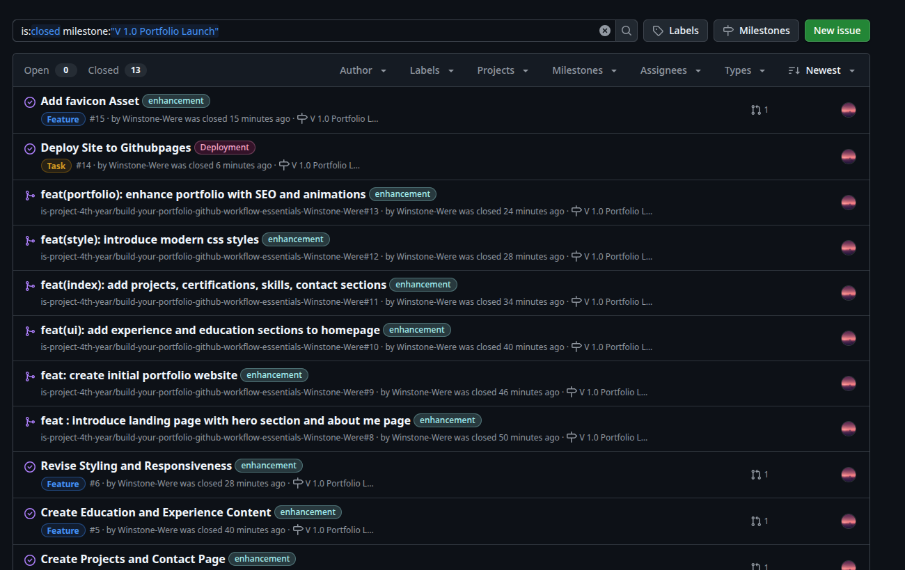
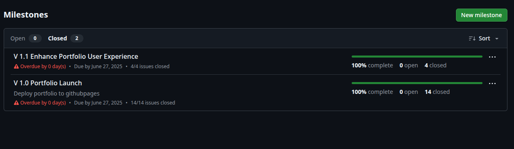
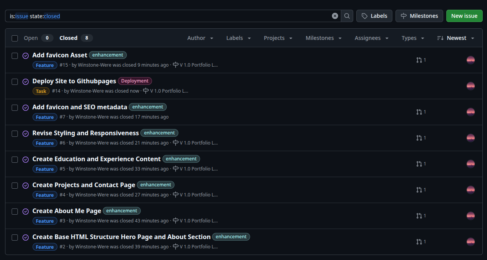
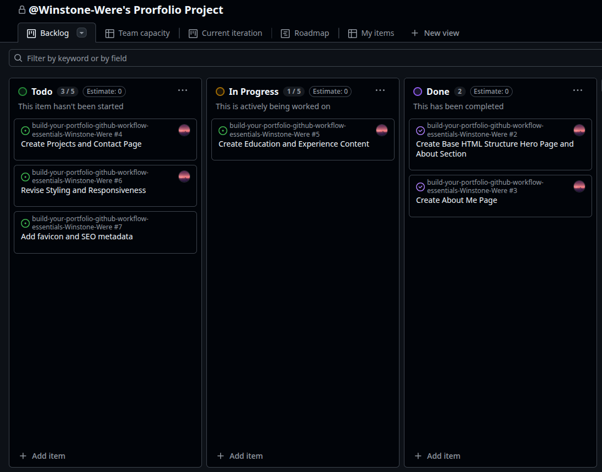
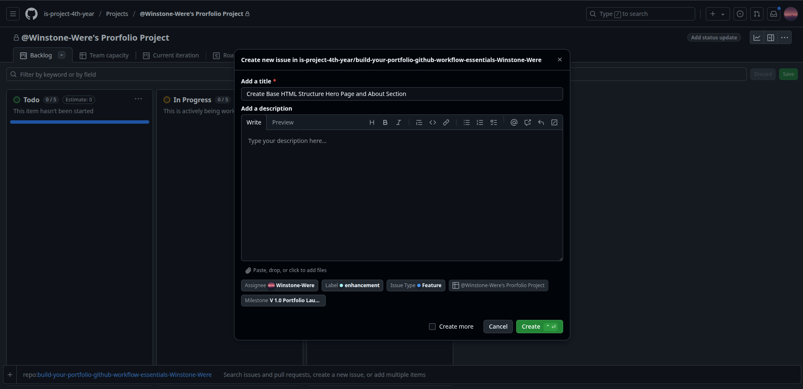
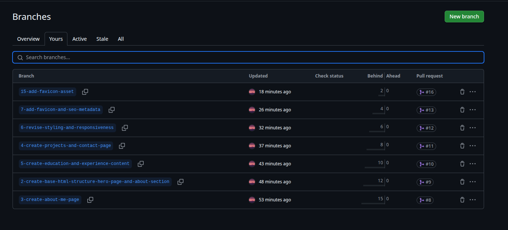
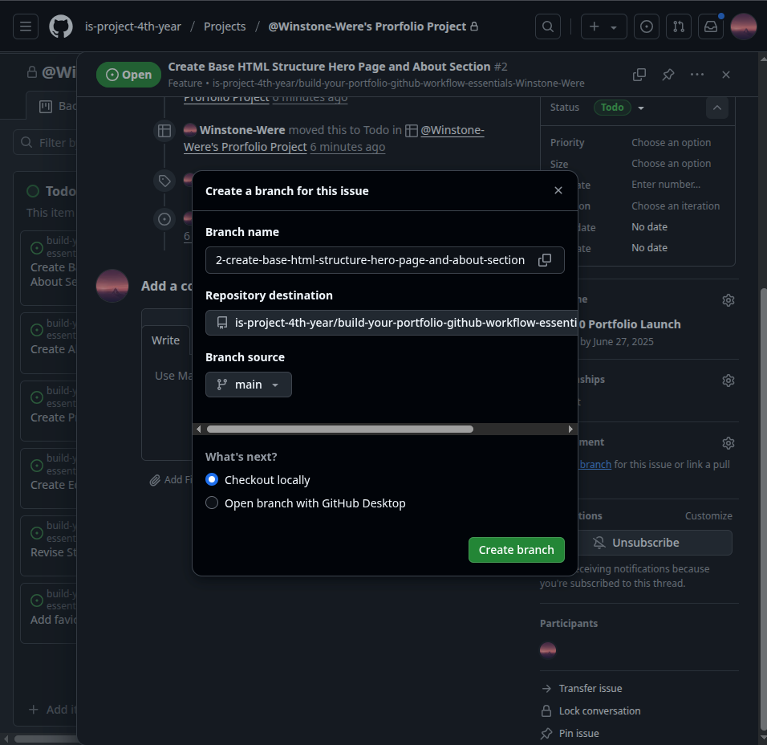
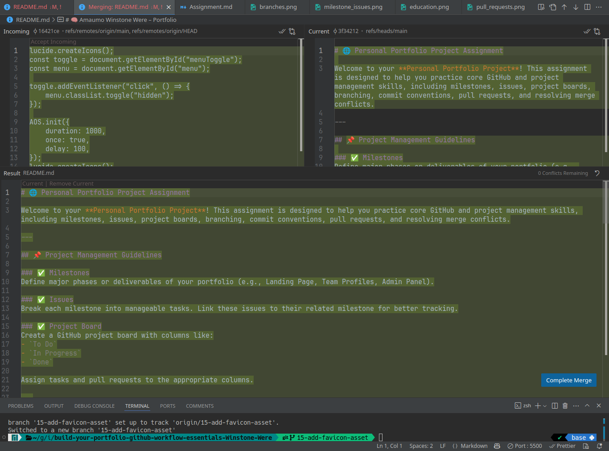

# Personal Portfolio Documentation

## 1. Student Details

- **Full Name**: Amaumo Winstone Were  
- **Admission Number**: 150797  
- **GitHub Username**: Winstone-Were 
- **Email**: winstone.amaumo@strathmore.edu

## 2. Deployed Portfolio Link

- **GitHub Pages URL**:  
  [https://is-project-4th-year.github.io/build-your-portfolio-github-workflow-essentials-Winstone-Were/](https://is-project-4th-year.github.io/build-your-portfolio-github-workflow-essentials-Winstone-Were/)

## 3. Learnings from the Git Crash Program

### Concept: Branching & Workflow

**Expectation 👀**: I thought branches were just for fixing bugs and advanced collaboration.

**Reality 😅**: Turns out, branches are super useful even when working alone! I used them to work on separate sections of my portfolio (like About, Projects, etc.) without breaking the main site.

**Impact 💡**: Helped me test changes safely before merging them to the main portfolio site.

---

### Concept: GitHub Projects

**Expectation 👀**: Thought it was a tool mostly used by companies or big dev teams.

**Reality 😅**: It’s actually just a handy visual board – like Trello – built right into GitHub!

**Impact 💡**: Gave me clarity while working on my site. I could drag tasks from “To do” to “Done”, and that really helped track progress across multiple portfolio sections.

---

### Concept: Pull Requests

**Expectation 👀**: Pull requests looked like a process for code reviews between developers.

**Reality 😅**: Even as a solo dev, they were useful for reviewing my own changes before merging!

**Impact 💡**: Using PRs helped me catch small errors (like typos or broken styles) before merging into the live site.

---

### Concept: Merge Conflict Resolution

**Expectation 👀**: I was scared of merge conflicts – thought they’d be too technical and confusing.

**Reality 😅**: It was just about reading and choosing which code to keep. GitHub even showed helpful highlights.

**Impact 💡**: I confidently handled a conflict when I accidentally edited the same section on two branches. Learned to solve it and keep my portfolio bug-free.

---

## 4. Screenshots of Key GitHub Features

### A. Milestones and Issues

- This screenshot shows how I grouped related tasks using milestones and tracked bugs or feature requests with issues.

---

### B. Project Board

- My GitHub Project Board helped me track my tasks visually. It shows items categorized into "To do", "In progress", and "Done".

---

### C. Branching

- I used meaningful branch names like `about-section-pr` to manage changes per section of the site.

---

### D. Pull Requests

- This shows my pull request for the About section. It was linked to its issue and reviewed before merging.

---

### E. Merge Conflict Resolution

- At one point, two branches conflicted. Here's how I resolved the merge conflict through GitHub’s UI.

---

